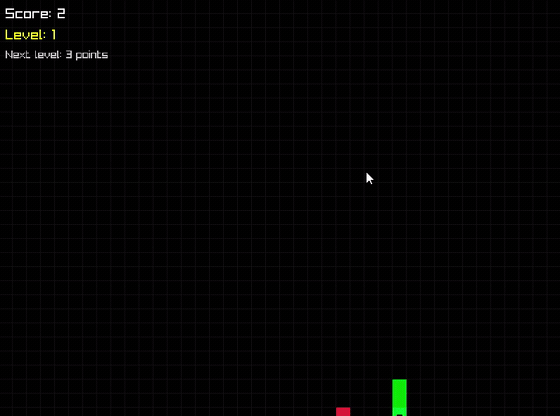

# 🐍 Multi-Level Snake Game (C++ / raylib)

A real-time Snake game built in **modern C++ (C++17)** with the [raylib](https://www.raylib.com/) graphics library. Built as a **Data Structures semester project** to demonstrate applied data structures, object-oriented design, and memory-safe real-time programming — the snake's body is a **custom doubly linked list**, implemented from scratch.

<p align="center">
  
</p>

---

## ✨ Features

- 🟢 Snake body modeled as a **hand-implemented doubly linked list** (manual pointer + memory management)
- 🧱 **5 progressive levels** with procedurally generated obstacle layouts (corner clusters, center block, maze pattern)
- 🎯 Up to **15 randomized obstacles** placed via rejection sampling (never spawn on an occupied cell)
- 🍎 **3 tiers of food** with probability-weighted spawning and bonus points
- ⚡ Dynamic speed scaling and **frame-rate-independent movement** (60 FPS target)
- 🔁 Clean **finite state machine**: Title → Playing → Level-Up → Game Over
- 🏆 Session high-score tracking

---

## 🧱 Data Structures Used

| Structure | Role in the game |
|-----------|------------------|
| **Doubly Linked List** *(custom)* | The snake's body — O(1) head insert / tail remove each frame |
| **Queue** | Active food management |
| **Stack** | Movement direction history |
| **Vector / Deque** | Obstacles & rendering positions |

---

## 🛠️ Tech Stack

**Language:** C++17 · **Graphics:** raylib · **Compiler:** g++ (MinGW-w64) · **Editor:** VS Code

---

## 🚀 Build & Run

You'll need [raylib](https://github.com/raysan5/raylib) installed. Update the include/lib paths below to match your setup.

```bash
g++ src/main.cpp -o game.exe \
    -I<C:/raylib-master>/src \
    -L<C:/raylib-master/src \
    -lraylib -lopengl32 -lgdi32 -lwinmm

./game.exe
```

> On Windows with the raylib w64devkit, the included `.vscode/tasks.json` will build the project with **Ctrl+Shift+B**.

---

## 🎮 Controls

| Key | Action |
|-----|--------|
| Arrow Keys | Move the snake |
| `SPACE` | Start / continue |
| `R` | Restart after game over |
| `ESC` | Return to title screen |

---

## 📁 Project Structure

```
multilevel-snake-cpp/
├── src/
│   └── main.cpp          # Game source (Snake, FoodManager, ObstacleManager, Game)
├── assets/
│   └── snake_demo.gif    # Gameplay demo
├── .vscode/              # Build / debug configuration
├── .gitignore
└── README.md
```

---

## 📌 Roadmap

- [ ] Persist high score to disk (file I/O)
- [ ] Re-enable the snake-body overlap check during food generation
- [ ] Split `main.cpp` into header/source files + add a CMake build
- [ ] AI snake mode using **BFS / A\*** pathfinding
- [ ] Unit tests for the linked-list operations

---

## 👥 Authors

Built as a 4th-semester Data Structures project at **FAST-NUCES** by:

- Taha Rizwan (https://github.com/taha1903-lab
- Usama Sikandar https://github.com/usamasikandar67

---

## 📄 License

Released under the [MIT License](LICENSE).
